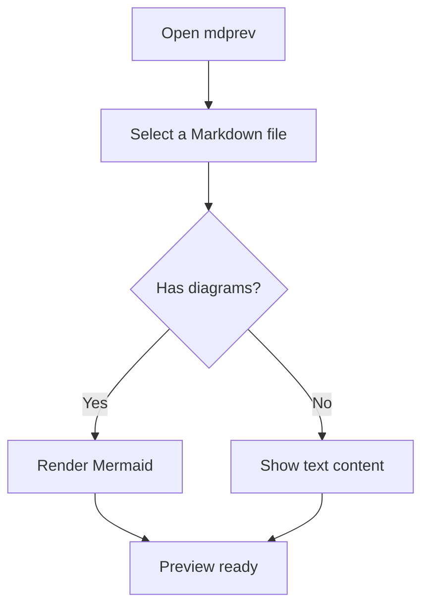
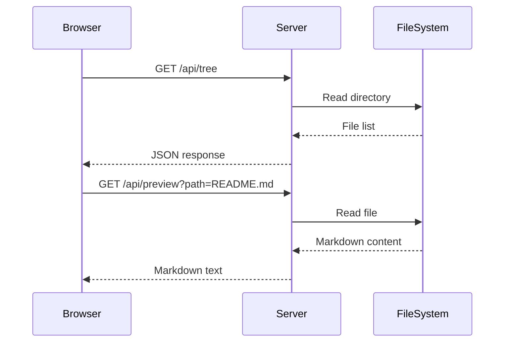
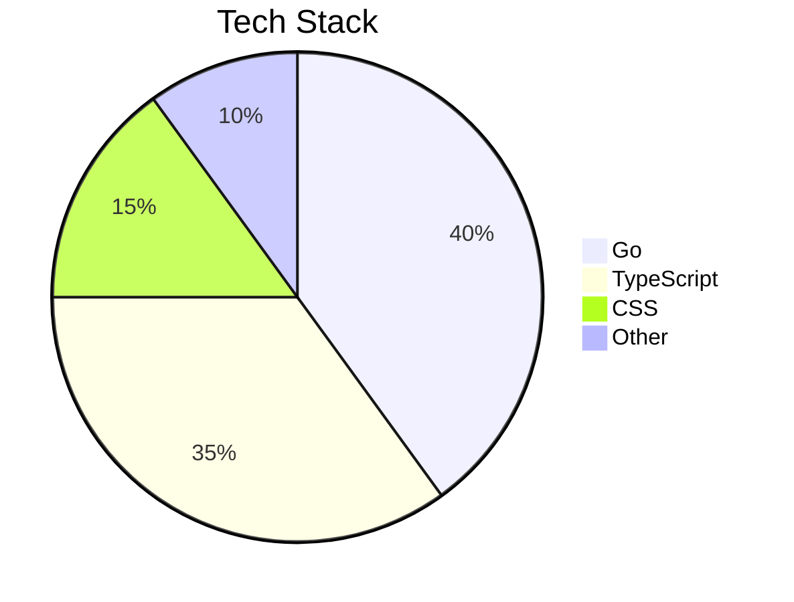

# Advanced Features

## Mermaid Diagrams

### Flowchart

### Sequence Diagram

### Pie Chart

## Math Equations (KaTeX)

### Inline Math

The quadratic formula is $x = \frac{-b \pm \sqrt{b^2 - 4ac}}{2a}$, where $a \neq 0$.

### Block Math

$$
\int_{-\infty}^{\infty} e^{-x^2} dx = \sqrt{\pi}
$$

$$
\sum_{n=1}^{\infty} \frac{1}{n^2} = \frac{\pi^2}{6}
$$

## Alerts

> [!NOTE]
> "Any fool can write code that a computer can understand.
> Good programmers write code that humans can understand."
>
> — Martin Fowler

> [!TIP]
> Use `mdprev` with live reload for the best writing experience.

> [!WARNING]
> Large Mermaid diagrams may take a moment to render.

> [!CAUTION]
> Do not expose `mdprev` on a public network. It is designed for local use only.

## Frontmatter

This file doesn't have frontmatter, but check out [README.md](README.md) for an example with YAML frontmatter.
